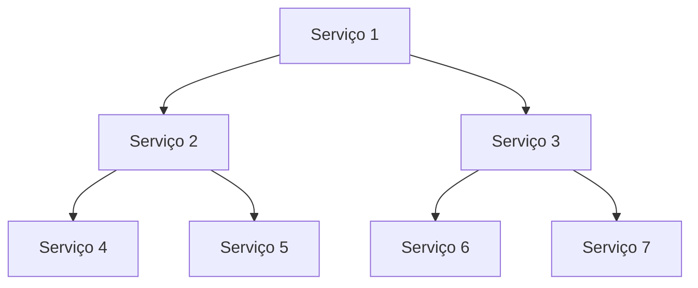

# Arquitetura de Sistemas Avançado
> Curso

---

## Conceitos de integração de sistemas e mensageria

> Módulo

## Aprenda o que é e como funciona arquitetura em mensageria:

> Aula

### Arquitetura básica:


#### Prós:

* **Desacoplamento**: menos dependênica entre os nodos;
* **Fácil plug ans play**: adicionar features com outras stacks simplismente usando as mensagens já existentes;
* **Comunicação assíncrona**: o client não tem que esperar o processamento;
* Simples **escalabilidade**;
* **Broadcasting**;
* Permite **Event Source**;

#### Contras:

* **Single point of failure** no message broaker;
* **Difícil monitoramento** e rastreamento de fluxos;

---

### Comunicação assíncrona entre serviços:

#### Mais linear:


---
#### Mais complexo:



---

## Gerenciamento de erros em uma arquitetura assíncrona:

> Aula

---

* Dead letter queue (Filas de re-tentativas);
* Moniteramento entre serviços;
* Rastreamento de fluxo.

### Exemplo de inconsistência de dados:


### Exemplo de rastreamento de fluxo:


---

## Arquitetura de dados não estruturados e business intelligence

> Módulo

## Business Intelligence em Modelos de Dados

> Aula:

### BI - Business Intelligence:

* Um conjunto de ferramentas para modelar os dados em apoio à decisões estratégicas.

#### Componentes básicos:

* Ferramentas;
* Infraestrutura;
* Profissionais (corpo técnico);
* Dados.

#### BI - Data:

* Geralmente vem do SGDB da corporação;
* Dados esternos à corporação;
* Pesquisas de campo;
* Dados gerenciais;
* Indicadores de mercado.

#### BI - Solution:

* Infraestrutura;
* Gerenciamento dos dados;
* Análise dos dados;
* Compartilhamento dos dados;
* Ferramentas gerais: IA, gerenciamento de falhas etc.

#### BI - Ferramentas:

* Power BI;
* DOMO;
* Oracle;
* Sas;
* SAP Business.

---

## Aprenda sobre os conceitos de Data Warehouse:

> Aula

* Um estilo de modelagem dos dados para acomodá-los de forma que eles sejam eficientes e adaptados ao BI.

---

### OLTP x OLAP

* OnLine Transation Processing: tende a atender uma gama muito grande de usiários, vendedores, sistemas e várias transações ao mesmo tempo.
* OnLine Analytical Processing: gama mais reduzida, diretores, coordenadores de setor etc.


---

## O que é Big Data e dados não estruturados:

> Aula

* Big Data é um termo que descreve um grande volume da dados, sendo ele, estruturado, não estruturado ou semi-estruturado.
* Formatos diversos: áudio, e-mails, sensores, satélites, outros banco de dados.
* Ferramentas são usadas para extrair informações dessa grande massa de dados.

### Dados estruturados:

* Em BD estruturados, é necessário seguir regras para alterar as estruturas.
* Tabelas, chaves, relacionamentos, formato bem definido etc

### Dados semi-estruturados:

* XML, RDF, OWL, JSON;
* Dá liberdade para a inserção de dados sem uma regra definida.

### Dados não estruturados:

* Dados com formatos não definidos e totalmente variáveis;
* Tweets, e-mails, mensagens etc.

---

## Data Lake vs Big Data

> Aula

* Data Lake é um Big Data mais reservado, corporativo, planejado, tratado etc.
* Ele pode conter, dados estruturados, semi-estruturados ou não estruturados.
* Pode ter pré-processamento planejado, categorização, etc
* Pode ter uma ingestão em outro banco de dados com os dados já tratados;

---

### Exemplo prático: MongoDB:

> Bando de dados semi-estruturado baseado em JSON.

#### Realizando operações:

```cmd
use loja
db.produtos.insert({codigo:"01", descricao: "caneta"})
show databases
db.produtos.find()
```

---

## Fundamentos de arquitetura de aplicações em nuvem

> Módulo

## Arquitetura em Nuvem e sua evolução

> Aula

### Cloud Computing:

* Gerenciamento de hardware/software;
* Provedores de servidor e armazenamento;
* Pague o que consumir;
* Iaas / Paas / Bass.

### Instructure as a Service - IAAS:

* "Aluguel" de uma infra-estrutura física que é provida por empresas;

### Platform as a Service - PAAS:

* Plataforma de automatizações e gerenciamento da infraestrutura;

### Backend as a Service - BAAS:

> Aka.: Mobile Backend as a Service;

* Permite o desenvolvedor fazer o UX e o front-end e não se preocupar com autenticações DB etc;
* Se comunicando com o serviço de backend por API;

---

## Entenda sobre disponibilidade de aplicações:

> Aula

### Disponibilidade:

* **IAAS:** hardware e internet;
* **PASS:** auto scale on the go;
* **BAAS:** não há backend service.

* Kubernets (K8S) - orquestra os container da aplicação;
* Múltiplos nodos;
* Load balacer - distribuir os requests entre os workers;

---

## Aprenda a executar serviços como Serverless:

> Aula

### Vantagens:

* Sem servidor;
* Sem serviço "rodando";
* Sem down time;
* Não precisar gerenciar as máquinas que o provedor disponibiliza;

### Desvantagens:

* Custo maior;
* Mais estruturas condicionais no código;

___

## Desenvolvimento e operação de software integrado:

> Módulo

---

## O que é DevOps?

> Aula

* Na área de tecnologia, haviam três setores complementares:
  * O desenvolvimento;
  * A garantia de qualidade;
  * Operações de TI;

* Esses setores, apesar de complementares, trabalhavam totalmente desacoplados. Isso dificultada e diminuía a velocidade do trabalho.
* O **DevOps** é a junção destes três setores.


### Framework CALMS:

* Culture;
* Automation;
* Lean;
* Meossurement;
* Sharing.

---

#### Culture:

* Todas as ferramentas e automações são inúteis não forem acompanhadas pela verdadeira disposição em trabalhar juntos;

* O DevOps não resolve problemas de ferramentas de sim problemas de humanos;

#### Automation:

* **Eliminar qualquer trabalho manual** e repetitivos fazendo por humanos;

* Automatizar gera **velocidade na entrega** e deixa o trabalho mais **produtivo**;

#### Lean:

* Focar nas entregas de valor ao cliente;
* Ter objetivos enxutos.
* Conhecimento das limitações e gargalos;

#### Meassurement:

> Mensuração

* O DevOps é totalmente **cíclico**;
* Obter métricas de ciclos de desenvolvimento para gerar melhorias constante;

#### Sharing:

* Compartilhar informações entre os times;
* Decentralizar o conhecimento;
* Desacoplamento e não dependência;

---

### Os três caminhos:

* Flow;
* Feedback;
* Learnig;

---

#### Flow:

* Eliminar desperdícios;
* Gargalos no processo;
* Automações;
* Integração contínua;

#### Feedback:

* Visam resolver problemas o quanto antes;
* Alertas de qualquer falhas;
* Monitoramento;

#### Learning:

* Experimentação;
* Gerar conhecimento durante todo o desenvolvimento de software;
* Fruto do processo científico;
* Trabalho dinâmico;
* Eliminar acultura da culpa;
* Compartilhamento de conhecimento;

---

### Entregando o software:

* Em ciclos;

---

#### Plan:

* Definir objetivos e brainstorm de como resolver o problema;

##### Ferramentas:

* Teams;
* Draw.io;
* Balsamiq;
* Roadmunk;
* Confluence;
* Jira;

---

#### Code:

* O desenvolvimento da codificação em sí;

##### Ferramentas:

* VS Code;
* GitHub;
* Sublime Text;
* Cmder;
* Git;
* Notepad++;

---

#### Build:

* Colocar o código em execução;

##### Ferramentas:

* Container;
* Docker;
* Npm;
* Nuget;
* Cri-o;
* .NET CLI;
* MSBuild;

---

#### Test:

* Fazer teste e identificar erros durante o Build;

##### Ferramentas:

- Unit.net;
- Loader.io;
- JMeter;
- Selenium;
- Runscope;
- Postman;
- SonarQube;
- Code Climate;
- Codacy;

---

#### Release e Deploy:

* Disponibilizar o software;
* Implementar definitivamente o software;

##### Ferramentas:

* Azure Pipelines;
* Circle CI;
* App Veor;
* GitLab CI;
* Travis CI;
* Jenkins;

---

#### Operate:

* Suporta a implementação;

##### Ferramentas:

* Kubernetes;
* Rancher;
* Microsoft Azure;
* Puppet;
* Terraform;
* Chef;
* Open Shift;
* AWS;

---

#### Monitor:

> Monitoramento/Telemetria

* Coletar métricas;
* Coletar e entender o feedback;

##### Ferramentas:

* Data log;
* Prometheus;
* App Metrics;
* Rollbar;
* Zabbix;
* New Relic;
* Pushover;
* Seq;
* Monitis;

---


---

## Continuos Integration:

> Aula


### Principais Ferramentas:

* Azure Pipelines;
* Circle CI;
* App Veor;
* GitLab CI;
* Travis CI;
* Jenkins;

---

### Status Badge:

* "Icone" que mostra o status do build;

---

## Continuos Inspection:

### Principais ferraments:

- SonarQube;
- Code Climate;
- Codacy;

---

### Identificam:

#### Complexidade Ciclomática;

* Número de estruturas condicionais e de repetição, que deixam o código mais complexo sem necessicidade.

#### Códigos Duplicado:

* Que podem ser substituídos por funções, refatorados etc;

#### Vulnerabilidades / Code Smell:

* Uma senha hardcoded;
* Funções muitos grandes;
* Comandos que foram comentados;

#### Padronização e estilo:

* Ponto e vírgula desnecessários;
* Explicidade desnecessária  de declarações booleanas literais;

#### Débito Técnico:

* Uma implementação que levaria mais tempo, porém resolveria de uma vez o problema é substituída por várias micro-implementações;

#### Cobertura de Testes:

* Visualização de quais trechos foram analisados;
* Os resultados dos testes;

#### Métricas:

* Testes antes da implementação que definem se o código pode ou não ser implementado;

#### Validando Pull-Requets:

* Bloqueiam merges se não passaram em certos testes;

---

# Certificado \P/

### https://certificates.digitalinnovation.one/C81FC919