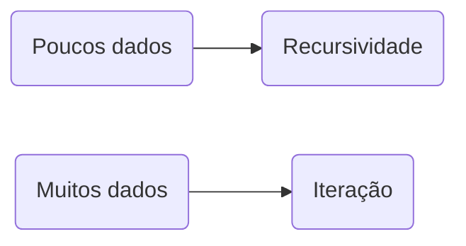

# Desenvolvimento avançado em Java

> H1 - Curso; H2 - Módulo; H3 - Aula.

## Paradigma Funcional em Java

### Entenda o que é Paradigma Funcional:

- A linguagem C foi construída no paradigma imperativo.
- Programação funcional é o processo de construir software através de composição de funções puras, evitando compartilhamento de estados, dados mutáveis e efeitos colaterais. É declarativa ao invés de imperativa. - Eric Elliot.
- Paradigma imperativo é aquele que expressa o código de comandos ao computador. 

#### Exemplo de código imperativo:

```java
public class Imperativo {
    public static void main(String[] args) {
        int val = 10;
        int result = val * 3;

        System.out.println(result);
    }
}
```

#### Exemplo de código funcional:

```java
import java.util.function.UnaryOperator;

public class Funcional {
    public static void main(String[] args) {
        UnaryOperator<Integer> calcVezes3 = (val) -> val*3;

        int val = 10;
        System.out.println(calcVezes3.apply(val));
    }
}
```

---

### Funções e imutabilidade em Paradigma Funcional:

#### Composição de funções:

- Criar uma função a partir de outras como parâmetro.

#### Exemplo de código:

- A partir de um array de números, pegar apenas os pares, multiplicar por 2 e imprimir na tela

##### Imperativo:

```java
public class ExemploImperativo {
    // Multiplica por 2 e imprime um valor caso ele seja par
    // Imperativa
    public static void main(String[] args) {
        int[] vals = {1,2,3,4,5,6,7,8,9,10};

        for (int i = 0; i < vals.length; i++) {
            int val = vals[i];

            // Se o número for par:
            if (val % 2 == 0) {
                val*= 2;

                System.out.println(val);
            }
        }
    }
}
```

##### Funcional (com composição de funções):

```java
import java.util.Arrays;

public class ExemploFuncional {
    // Multiplica por 2 e imprime um valor caso ele seja par
    // Funcional
    public static void main(String[] args) {
        int[] vals = {1,2,3,4,5,6,7,8,9,10};
        
        Arrays.stream(vals)
                    .filter(val -> val % 2 == 0)
                    .map(val -> val * 2)
                    .forEach(val -> System.out.println(val));
    }
}
```

---

#### Funções puras:

- Uma função que, dado os mesmos parâmetros, produz o mesmo resultado independente de quando a função é chamada.

#### Conceito da imutabilidade:

- Uma variável ou objeto passado como parâmetro não pode ser alterado diretamente.

##### Exemplo Tentativa de Mutabilidade:

```java
...
    int val = 20;
	UnaryOperator<Integer> retornaDobro = n -> n*= 2;

	System.out.println(val); // 20
	System.out.println(retornaDobro.apply(val)); // 40
	System.out.println(val); // 20 (a variável não pôde ser alterada)
...
```

##### Exemplo Imutabilidade:

```java
...
    int val = 20;
	UnaryOperator<Integer> retornaDobro = n -> n * 2;

	System.out.println(val); // 20
	System.out.println(retornaDobro.apply(val)); // 40
	System.out.println(val); // 20 (a variável não foi alterada)
...
```

---

### Lambda no Java:

- Facilita a legibilidade de funções

- Para criar uma lambda, deve-se usar uma interface funcional.

  - Uma interface que possua apenas um método abstrato.

  ```java
  @FunctionalInterface
  interface MinhaLambda {
      // Uma função abstrata que pode ter seu comportamento declarado numa lambda
      String gerar(String val);
  }
  ```

  ```java
  ...
      MinhaLambda colocaUmTexto = val -> val.concat(" (Gerado com MinhaLambda)");
  
  	System.out.println(colocaUmTexto.gerar("KKKKKK"));
  	// KKKKKK (Gerado com MinhaLambda)
  ...
  ```

- A flag @FunctionalInterface força o compilador a dar um erro caso a interface seja alterada e perca a propriedade de funcionalidade. Não é obrigatória.

- Formato lambda:

  ```java
  IntefaceFuncional nomeVariavel = (parametros) -> logica;
  ```

---

#### Regras de estruturação lambda:

- Quando a lambda possui apenas uma instrução na lógica, não é necessário o uso de chaves:

  ```java
  Funcao colocaPrefixoSr = val -> "Sr. " + val;
  ```

- Quando a lambda possui vária instruções, é necessário o uso de chaves, assim também como o uso explícito de `return`.

  ```java
  Funcao colocaPrefixoSrEPonto = val -> {
      String valComPrefixo = "Sr. " + val;
      String valComPonto = valComPrefixo + ".";
      return valComPonto
  }
  ```

---

#### Exemplo final:

- Função lambda que imprime um valor, n vezes.

```java
public class ExemploFinal {
    public static void main(String[] args) {
        Funcao minhaF = (val, vezes) -> {
            for (int i = 0; i < vezes; i++) {
                System.out.println(val);
            }
        };

        minhaF.gerar("KKK", 3);
    }
}

@FunctionalInterface
interface Funcao {
    void gerar(String val, int vezes);
}
```

---

### Recursividade em Java:

- Uma função chave a si mesma, até uma condição de parada.

#### Exemplo:

```java
public class Fatorial {
    public static void main(String[] args) {
        System.out.println(fact(5));
    }

    public static int fact(int n) {
        if (n == 1) {
            return n;
        } else {
            return n * fact(n - 1);
        }
    }
}
```

---

#### Limitações:

- **Tail Call (Recursividade em cauda):** quando não há nenhum comando após a chamada recursiva da função.
- A **JVM não suporta** a recursão em cauda e lança um estouro de pilha (StackOverFlow).

---

#### Memorization:

- Guardar os resultados da função recursiva num mapa estático.
- No início da função, testar se esses parâmetros já foram processados, ou seja, se eles já existem no mapa que foi criado.
- Se já existe, não é necessário processar novamente.

---



---

## Interfaces funcionais:

### Introdução da aula:

- Como funcionam lambdas e quando usa-las;
- O poder da nova API do Java 8;

---

### Facilitando o código da API:

#### Funções de alta ordem:

- Recebem ou retornam funções.

#### Exemplo de código:

```java
public class FuncaoAltaOrdem {
    public static void main(String[] args) {
        Calc sum = (a, b) -> a+b;

        System.out.println(applyLambd(sum, 3, 14));
    }

    public static int applyLambd(Calc lambdaOperator, int x, int y) {
        return lambdaOperator.doOpt(x, y);
    }
    /**
    * A função applyLambd aplica um comportamento à
    * dois inteiros, mas esse comportamento é definido
    * como parâmetro. Logo, o método applyLambd é uma
    * função de alta ordem.
    */
}

@FunctionalInterface
interface Calc {
    public int doOpt(int x, int y);
}
```

---

### Explorando funções de alta ordem:

#### Java.util.function:

##### Consumer:

- Recebe um parâmetro e não retorna nada.

```java
import java.util.function.Consumer;

public class ConsumerTest {
    public static void main(String[] args) {
        Consumer<String> print = (StringPar) -> System.out.println(StringPar);

        /**
         * Outra sintaxe:
         * Consumer<String> print = System.out::println;
         */
        
        print.accept("KKKKKKK");
    }
}
```

---

### Aprenda sobre parâmetro da função:

#### Function:

- Recebe dois generics: O tipo de dado que será fornecido como parâmetro, e o tipo de dado que irá ser retornado pela função.

  ```java
  import java.util.function.Function;
  
  public class FunctionTest {
      public static void main(String[] args) {
          Function<Integer, Integer> dobra = n -> n*2;
  
          System.out.println(dobra.apply(5));
      }
  }
  ```

#### Predicate:

- Recebe um generic: O tipo do parâmetro. Retorna sempre um booleano.

```java
import java.util.function.Predicate;

public class PredicateTest {
    public static void main(String[] args) {
        Predicate<Integer> ehPar = n -> n % 2 == 0;
        System.out.println(ehPar.test(8)); // true
        System.out.println(ehPar.test(9)); // false

        Div ehDivPor = (x, y) -> x % y == 0;
        System.out.println(ehDivPor.test(14, 7)); // true
        System.out.println(ehDivPor.test(25, 2)); // false
    }
}

@FunctionalInterface
interface Div {
    Boolean test(int x, int y);
}
```

#### Supplier:

- Não recebem parâmetro e retornam algo.

  ```java
  import java.time.LocalTime;
  import java.util.function.Supplier;
  
  public class SuplierTest {
      public static void main(String[] args) {
          Supplier<LocalTime> nowTime = () -> LocalTime.now();
  
          System.out.println(nowTime.get());
      }
  }
  ```

---

### Iterações entre as funções:

```java
import java.util.stream.Collectors;
import java.util.stream.Stream;

public class Iteracoes {
    public static void main(String[] args) {
        String[] nomes = {"Lu", "Ra", "Gu", "Pe", "Bru", "Ga", "Vi"};

        String imprimir = Stream.of(nomes)
                            .collect(Collectors.joining(" == "));
        System.out.println(imprimir);
        /** 
         * Printa:
         * Lu == Ra == Gu == Pe == Bru == Ga == Vi
         */                  
        
    }
}
```

---

## Processamento Assíncrono e Paralelo:

### O que é síncrono e assíncrono:

#### Thread:

- Um pequeno programa, que trabalha como um subsistema, se divide em duas ou mais tarefas. Essas tarefas múltiplas podem ser executadas simultaneamente, rodando mais rápido ou praticamente junto ao processo principal.
- É possível definir ordens de prioridade de processos.

#### Processamento síncrono:

- Várias atividades que ocorrem em sequencia, e em fila. Um processo tem que terminar para o próximo começar.

#### Processamento assíncrono:

- Várias atividades são executadas em simultâneo. Um processo não precisa finalizar para o outro se inicie.

### Desenvolvendo uma API de Threads do Java:

#### Usando a assíncronicidade:

1. Criamos uma classe que implementa a Runable;

```java
class Barra implements Runnable {
    
}
```

2. Sobrescrevemos o método run, descrevendo o comportamento.

```java
class Barra implements Runnable {
    @Override
    public void run() {
        /**
         * Conta de 0 a 9, com pausas de um segundo.
         */
        for (int i = 0; i < 10; i++) {
            System.out.println(i);
            try {
                Thread.sleep(1000);
            } catch (InterruptedException e) {
                e.printStackTrace();
            }
        }
    }
}
```

3. No método main, criamos as diferentes Threads onde serão rodados os processos simultânea e paralelamente. O comportamento é passado como parâmetro:

```java
...
    public static void main(String[] args) {
        Thread t1 = new Thread(new Barra());
        Thread t2 = new Thread(new Barra());
    }
...
```

4. Dar o comando para iniciar os processos:

```java
...
    public static void main(String[] args) {
        Thread t1 = new Thread(new Barra());
        Thread t2 = new Thread(new Barra());
        t1.start();
        t2.start();
    }
...
```

- Os processos vão rodar em simultâneo, gerando um output do tipo:

  ```terminal
  0
  0
  1
  1
  2
  2
  3
  3
  4
  4
  5
  5
  6
  6
  7
  7
  8
  8
  9
  9
  ```

- Os comandos do main continuam rodando, de modo em que o código:

```java
...
	public static void main(String[] args) {
            Thread t1 = new Thread(new Barra());
            Thread t2 = new Thread(new Barra());
            t1.start();
            t2.start();
            System.out.println(1234);
        }
...
```

- Gera um output:

```terminal
1234
0
0
[...]
9
9
```

---

#### Exemplo de código:

```java
public class SincAsinc {
    public static void main(String[] args) {
        GeradorPDF geradorPDF = new GeradorPDF();
        Barra barra = new Barra(geradorPDF);
        geradorPDF.start();
        barra.start();
    }
}

class GeradorPDF extends Thread {
    /**
     * (Classe exemplo e não literal)
     * Espera 5 segundo e printa um log.
     */
    @Override
    public void run() {
        try {
            Thread.sleep(5000);
        } catch (InterruptedException e) {
            e.printStackTrace();
        }
        System.out.println("\nPDF Gerado!");
    }
}

class Barra extends Thread {
    /**
     * Recebe a Thread do Gerador de PDF
     * como parâmetro do construtoe e usa
     * o método .isAlive() para parar de
     * rodar quando o PDF já foi gerado.
     */
    Thread geradorPDF;

    public Barra(Thread geradorPDF) {
        this.geradorPDF = geradorPDF;
        System.out.print("Loading");
    }

    @Override
    public void run() {
        try {
            while (true) {
                Thread.sleep(500);

                if (!geradorPDF.isAlive()) {
                    break;
                } else {System.out.print(".");}
            }
        } catch (InterruptedException e) {
            e.printStackTrace();
        }
    }
}
```

---

### Utilizando o Parallel Streams:

- Faz algum tipo de processamento numa Stream em vários itens ao mesmo tempo.
- Os itens devem ser independentes entre si.
- Só é vantajoso quando utilizado numa coleção grande.

---

- Agora vamos fazer um programa com e sem Parallel Streams.
- O programa calcula o fatorial de uma lista com 99999 números.

#### Exemplo de programa sem Parallel Streams:

```java
import java.util.stream.IntStream;

public class WithoutParaStreams {
    public static void main(String[] args) {
        long start = System.currentTimeMillis();
        IntStream.range(1, 100000)
                        .forEach( n ->
                            fact(n)
                        );
        long end = System.currentTimeMillis(); // Cerca de: 7050
        System.out.println(end-start);
    }
    
    public static int fact(int n) {
        int fact = n;

        for (int i = n-1; i >= 1; i--) {
            fact*= i;
        }

        return fact;
    }
}
```

#### Com Parallel Streams:

```java
import java.util.stream.IntStream;

public class WithParaStreams {
    public static void main(String[] args) {
        long start = System.currentTimeMillis();
        IntStream.range(1, 100000)
                        .parallel()
                        .forEach( n ->
                            fact(n)
                        );
        long end = System.currentTimeMillis();
        System.out.println(end-start); // Cerca de: 2140
    }
    
    public static int fact(int n) {
        int fact = n;

        for (int i = n-1; i >= 1; i--) {
            fact*= i;
        }

        return fact;
    } 
}

```

---

## Por dentro da modularização do Java

### Entendendo o que é a modularização por meio de Jiogsaw:

- Foi uma nova realease do Java 9
- Composto por uma série de JEPs (miniversões)

---

### Iniciando um projeto com Java Modular:

- Por padrão todo sistema modular já vem com o java.base.
  - java.io
  - java.util
  - java.lang

---

## Novidades do Java 10

### Parte 1:

#### Requests com Java:

```java
import java.io.BufferedReader;
import java.io.IOError;
import java.io.IOException;
import java.io.InputStreamReader;
import java.net.URL;
import java.net.URLConnection;
import java.util.stream.Collectors;

public class Requests {
    public static void main(String[] args) throws IOException {
        URL url = new URL("https://pt.wikipedia.org/wiki/Go_(linguagem_de_programa%C3%A7%C3%A3o)");
        URLConnection urlConnection = url.openConnection();
        BufferedReader bufferedReader = new BufferedReader(new InputStreamReader(urlConnection.getInputStream()));

        System.out.println(
            bufferedReader.lines()
                        .collect(Collectors.joining())
                        .replaceAll(">", ">\n")
        );
    }
}
```

#### Output:

```terminal
{HTML da página}
```

---

### Parte 2:

#### Inferência:

- Usando a expressão `var`em vez do tipo da variável.
- O tipo é automaticamente definido com o tipo de retorno.

##### Exemplo:

```java
URL url1 = new URL("https://google.com");
var url2 = new URL("https://youtube.com");
```

* Nos dois casos, o tipo definido é URL pois o construtor `new URL()` retorna uma variável desse tipo.

#### Reescrevendo o código acima utilizando inferência:

```java
import java.io.BufferedReader;
import java.io.IOException;
import java.io.InputStreamReader;
import java.net.URL;
import java.util.stream.Collectors;

public class Inference {
    public static void main(String[] args) throws IOException {
        var url = new URL("https://pt.wikipedia.org/wiki/Go_(linguagem_de_programa%C3%A7%C3%A3o)");
        var urlConnection = url.openConnection();
        var bufferedReader = new BufferedReader(new InputStreamReader(urlConnection.getInputStream()));

        System.out.println(
            bufferedReader.lines()
                        .collect(Collectors.joining())
                        .replaceAll(">", ">\n")
        );
    }
}
```

---

#### Exceções:

- Nem sempre podemos utilizar o var no lugar do tipo explicitado
- Só podemos usar com variáveis locais
- O símbolo var só pode ser criado a nível de escopo
- Não conseguimos usá-lo a nível de classe
- Não podemos utilizar também como definição de parâmetro.

---

#### Refatorando o código:

- Para melhor organização, vamos criar a implementação acima num método:

  ```java
  import java.io.BufferedReader;
  import java.io.IOException;
  import java.io.InputStreamReader;
  import java.net.URL;
  import java.util.stream.Collectors;
  
  public class Inference {
      public static void main(String[] args) throws IOException {
          connectAndPrintBody("https://pt.wikipedia.org/wiki/Go_(linguagem_de_programa%C3%A7%C3%A3o)");
      }
  	
   // Não podemos utilizar connectAndPrintBody(var urlString)
      public static void connectAndPrintBody(String urlString) throws IOException {
          // mas podemos usar no escopo local do método:
          var url = new URL(urlString);
          var urlConnection = url.openConnection();
          var bufferedReader = new BufferedReader(new InputStreamReader(urlConnection.getInputStream()));
  
          System.out.println(
              bufferedReader.lines()
                          .collect(Collectors.joining())
                          .replaceAll(">", ">\n")
          );
      }
  }
  ```

---

## O que mudou no Java 11

### O que mudou no Java 11:

#### HTTP Client API:

- Visa substituir a classe HttpUrlConnection legada.
- O problema com a API antiga é que ela muito verbosa e não intuitiva.
- A nova API suporta:
  - HTTP 1.1 e 2
- Suporta nativamente WebSockets.

---

### Aplicando as novas features - Parte 1:

#### HTTP Client em uso:

- Utilizaremos como base a mesma implementação anterior.

```java
import java.io.IOException;
import java.net.URI;
import java.net.http.HttpClient;
import java.net.http.HttpRequest;
import java.net.http.HttpResponse;

public class ClienteHTTPExemplo {
    public static void main(String[] args) throws IOException, InterruptedException {
        connectAndPrintBody("https://pt.wikipedia.org/wiki/Go_(linguagem_de_programa%C3%A7%C3%A3o)");
    }
	
    public static void connectAndPrintBody(String urlString) throws IOException, InterruptedException {
        var request = HttpRequest.newBuilder()
                            .GET().uri(URI.create(urlString))
                            .build();
        HttpClient httpClient = HttpClient.newHttpClient();
        HttpResponse<String> response = httpClient
                    .send(request, HttpResponse
                                .BodyHandlers
                                .ofString());

        System.out.println(response.statusCode()); // 200 OK
        System.out.println(response.headers()); // Headers
        System.out.println(response.body()); // HTML Body
    }
}
```

---

#### Diferenças entre HTTP 1 e 2:

- No HTTP 1.1, enviamos uma requisição e recebemos uma resposta.
- Suponhamos que temos 20 requisições a fazer, mas só é suportado 6 ao mesmo tempo. Logo, enviamos as 6, e quando uma responder, enviamos a próxima e assim por diante. Isso nos faz perder muita performance.
- No HTTP 2, é possível enviarmos múltiplas requisições numa única conexão.
- Essas requisições são transformadas em frames e são colocadas numa Stream.
- Pode chegar a ser 4x mais rápida do que o HTTP 1.
- Só podemos tirara proveito do HTTP2 se o servidor que estamos fazendo a requisição suporta o HTTP2.
- Caso não suporte, a requisição é automaticamente alterada novamente para o HTTP 1.

---

### Aplicando as novas features - Parte 2:

#### Inferência em Expressões Lambda:

- Na JDK 11 além de inferência na definição de variáveis, também é permitido em funções lambda.

##### Exemplo:

```java
import java.util.function.Function;

public class LambdInf {
    public static void main(String[] args) {
        Function<Integer, Integer> ehDivPor = (var x) -> x % 2;

        var resp = ehDivPor.apply(20);

        System.out.println(resp);
    }
}
```

---

#### String Blank:

- Saber se uma String está vazia antes do release:

```java
public class BlankString {
    public static void main(String[] args) {
        String nonBlankString = "Luis";
        String blankString = "              ";
        String otherBlakString = "";
        String oneMoreBlakString = null;

        System.out.println(isStringBlank(nonBlankString));
        System.out.println(isStringBlank(blankString));
        System.out.println(isStringBlank(otherBlakString));
        System.out.println(isStringBlank(oneMoreBlakString));

        /**
         * OUTPUT IN TERMINAL:
         * false
         * true
         * true
         * true
         */
    }

    public static Boolean isStringBlank(String toTest) {
        // if the String is null or not have any char or all chars are blank spaces
        if (toTest == null || toTest.length() == 0 || toTest.chars().allMatch(c -> c == ' ')) {
            return true;
        } else {return false;}

    }
}
```

- A Partir da JDK 11:

```java
public class BlankString {
    public static void main(String[] args) {
        String nonBlankString = "Luis";
        String blankString = "              ";
        String otherBlakString = "";
        String oneMoreBlakString = null;

        System.out.println(nonBlankString.isBlank());
        System.out.println(blankString.isBlank());
        System.out.println(otherBlakString.isBlank());
        System.out.println(oneMoreBlakString.isBlank());

        /**
         * OUTPUT IN TERMINAL:
         * false
         * true
         * true
         * NullPointerException
         */
    }
}
```

---

#### Dividir uma String por quebras de linha numa Stream:

```java
import java.util.stream.Collectors;

public class StringLines {
    public static void main(String[] args) {
        var html = "<html>\n<body>\n<p>Teste<p>\n<body>\n<html>";

        var htmlLines = html.lines().collect(Collectors.toList());

        System.out.println(htmlLines);
        // [<html>, <body>, <p>Teste<p>, <body>, <html>]
    } 
}
```

---

#### Repetição de Strings:

- Imprimir "Luis" 10x

```java
public class Antingo {
    public static void main(String[] args) {
        var nome = "Luis";
        var aux = "";
        
        for (var i = 0; i < 10; i++) {
            aux+=nome;
        }
        
        System.out.println(aux);
        // "LuisLuisLuisLuisLuisLuisLuisLuisLuisLuis"
    }
}
```

```java
public class Antingo {
    public static void main(String[] args) {
        System.out.println("Luis".repeat(10));
        // "LuisLuisLuisLuisLuisLuisLuisLuisLuisLuis"
    }
}
```


---

#### Outras release:

- **List.of()**
- **Set.of()**
- **Etc.of()**

---

# Certificado \P/

#### https://certificates.digitalinnovation.one/9A993240