# Fundamentos da Arquitetura de Sistemas

> 29/05/2020

## <ins>Módulo:</ins> Vantagens e desenvolvimento de Web Services

## Serviços Web:

> Web Services

### Usos:

* Para que aplicações em linguagens diferentes se comunicarem entre sí.

* Foi criado para troca de mensagens, na linguagem XML, no protocolo HTTP identificado por URI.

  > URI: todo o "link", desde o https:// até os parâmetros, em teoria, uma URL só termina no sufixo .com .net .io .org .br etc. 

* Pode-se dizer que Serviços Web são API's que se comunicam sobre o protocolo HTTP.

  > API's podem se comunicar em outros protocolos.

### Vantagens:

* Linguagem comum;
* Integrações facilitadas;
* Reutilização da implementação facilitada;
* Segurança do banco de dados;
* Custos reduzidos de integrações.

### Principais Tecnologias:

* SOAP;
* REST;
* XML;
* JSON.

## Estrutura SOAP:

### Usos:

* SOAP - SImple Object Access Protocol
* Protocolo baseado em XML para acesso de serviços web, sobretudo por HTTP
* Como serviços web se comunicam
* Desenvolvido para facilitar integrações entre aplicações

### Vantagens:

* Permite integrações entre aplicações, independente de linguagem, pelo XML;
* Independe de plataforma e software;
* Meio de transporte genérico, pode ser usado por outros protocolos além de HTTP.

### Sobre XML:

* XML - Extensible Markup Language
* Criada em 90's pela W3C, que dita padrões na World Wide Web
* Deixa a separação de conteúdo facilitada
* Sem limitação de criação de tags
* Linguagem comum para integrações entre aplicações

### Estrutura SOAP:

* SOAP Envelope - Contém todos os outros;
* SOAP Header - Atributos e metadados da requisição;
* SOAP Body - Conteúdo, dados.

```html
<soap:Envelope>
    <soap:Header>
    </soap:Header>
    <soap:Body>
        <m:Linguagem>SOAP e não HTML</m:Linguagem>
        <m:meu_nome>Luis Felipe</m:meu_nome>
    </soap:Body>
</soap:Envelope>
     
```

## Entendendo o que é WSDL e XSD:

### WSDL:

* WSDL - Web Services Description Language
* Usado para descrever Web Services, serve como um contrato do serviço
* A descrição é feita em XML, especificando o acesso, operações e métodos

### XSD:

* XSD -XML Schema Definition
* É um esquema para escrever em XML
* Funciona como uma documentação, padroniza como deve ser montado uma SOAP message que será envido ao Web Service.

## Aprenda o que são REST, API e JSON:

### Rest:

* REST - Representational State Transfer
* É um estilo/design de arquitetura para serviços web
* Podem trabalhar com outros formatos

#### Vantagens:

* Permite integrações entre aplicações e entre cliente e servidor em páginas web e aplicações
* Utiliza métodos HTTP
* Arquitetura de fácil compreensão
* Muito eficiente

#### Estrutura:

1. CLIENTE: faz uma requisição HTTP para o servidor (GET, POST, PUT, DELETE...);
2. SERVIDOR: retorna um código de operação e uma mensagem (Texto, JSON, XML....).

### API:

* API - Application Programming Interface
* Conjuntos de rotinas documentados por uma aplicação para consumir suas funcionalidades

### Principais Métodos HTTP:

* GET - Solicita a representação de um recurso, busca uma informação;
* POST - Solicita a criação de um recurso/dado/informação;
* DELETE - Solicita a exclusão de um recurso;
* PUT - Solicita a atualização de um recurso.

### JSON:

* JSON - JavaScript Object Notation.
* Formatação muito leve
* Usa-se de uma estrutura de chave e valor e listas ordenada
* Uma das mais utilizadas
* Fácil leitura

```json
{
    "linguagen" : "JSON",
    "métodos_http" : {
        "quantidade" : 4,
        "itens" : [
            "GET",
            "POST",
            "DELETE",
            "PUT"
        ]
    },
    "meu_nome" : "Luis Felipe"
}
```

## Veja sobre integração com REST e métodos HTTP na prática:

### Código de Estado:

> Status code

* Usado pelo servidor para avisar o cliente sobre o estado da operação solicitada

* 1xx - Informativo

  > Avisar que o processo não deu erro, mas ainda não foi completamente concluído.

* 2xx - Sucesso

* 3xx - Redirecionamento

* 4xx - Erro do Cliente

  > Informações erradas ou indevidas. URI inválida (404 - Not Found)

* 5xx - Erro do Servidor

## <ins>Módulo:</ins> Conceitos de arquitetura em aplicações para Internet

> 29/05/2020

## Introdução a arquitetura de sistemas:

- Conceito de Arquitetura  em aplicações para a Internet

### Tipos de arquitetura de sistemas:

* Monolito;
  * Um único serviço recebe a requisição HTTP e faz as operações; 
* Microserviços;
  * #1: Cada serviço tem um papel e estes se comunicam DIRETAMENTE entre si;
  * #2:  Cada serviço tem um papel e estes se comunicam intermediador por um message broker, que não deixa um serviço dependente de outro;
  * #3: A requisição é enviada à um gerador de pipeline e depois redirecionada aos serviços.

## Comparando os modelos Monolito e Microserviços

### Prós e contras:

* #### Monolito:

  * **Prós:** baixa complexidade, Monitoramento simplificado.
  * **Contras:** Stack única, Compartilhamento de recursos, Acoplamento, Mais complexidade na escalabilidade específica.

* #### Microserviços #1:

  * **Prós:** Stack dinâmica, simples escalabilidade.
  * **Contras:** Acoplamento e dependência entre serviços, monitoramento mais complexo, provisionamento mais complexo.

* #### Microserviços #2:

  * **Prós:** Stack dinâmica, simples escalabilidade, desacoplamento.
  * **Contras:** Monitoramento mais complexo, provisionamento mais complexo.

  #### Microserviços #3:

  * **Prós:** Stack dinâmica, simples escalabilidade, desacoplamento, menor complexidade.
  * **Contras:** Provisionamento mais complexo, plataforma dependente do gerenciador de pipeline.

----

## <ins>Módulo:</ins> A arquitetura de aplicações móveis e internet das coisas

## Conceitos da Internet das Coisas:

### Arpanet:

* Projeto para interligar computador para pesquisar
* Evoluiu para a rede mundial de computadores

---

### A internet das Coisas:

* A internet conecta pessoas, mas também pode conectar coisas entre si e entra as próprias pessoas

#### Pra quê?

* Embutir sensores;
* Coletar dados dos sensores;
* Usar o dado para tomar decisões.

---

### Conceitos Básicos de IOT:

* Coisas: para gerar dados;
* Nuvem: para disponibilizar os dados;
* Inteligência: para utilizar os dados para resolver problemas.

---

### Aplicações Práticas:

#### Smart Building:

* Um edifício pode gerar muitos dados: catracas, tubulações, encanamentos;
* Melhorar a segurança, prevenção de incêndios etc.

#### Smart Home:

* Sensores de temperatura, energia, fechaduras, tomadas, alarmes;
* Notificações á distância, automações, prevenções etc.

#### Vestíveis/ Wearables:

* Dados de localização, fisionomia, padrões;
* Notificações, automações etc

#### Agricultura:

* Sensores de umidade etc.
* Irrigação automática etc.

#### Smart Transportation:

* Sensores de distancia etc.
* Alertas e freio automático etc.

#### RFID Suppy Chain:

* Sensores eletromagnéticos;

* Segurança e detecção e rastreamento de movimentação;

#### Energy Efficiency:

* Sensores de uso de energia;
* Identificar padrões e otimizar o uso.

---

### Computação Ubíqua:

* Quando os computadores "saem do nosso campo de visão" e se misturam com coisas do dia-a-dia.

---

### Desafios da IOT:

1. Privacidade e segurança;
2. Quantidade exponencial de dispositivos conectados a rede
3. Ser capaz de processar e armazenar uma enorme quantidade de informações
4. Gerar valor a partir dos dados coletados

## Arquitetura da internet das coisas e protocolo de comunicação:

### Dispositivos para conectar as coisas:

#### Atributos para a escolha:

* Baixo consumo de energia
* Considerar uma rede de dados limitada
* Resiliência: saber lidar com a falta de recursos
* Segurança: impedir intercepções/ alteração de dados
* Customização: deixar flexível para diversos ambientes
* Baixo custo

#### Exemplos de plataforma:

* **Arduíno:**

  * Plataforma de prototipagem
  * Com saídas e entradas
  * Desenvolver código em C/C++
  * Interface serial ou USB
  * Shields para conectividade
  * Exemplo de código:

  ```c
  int LED_PIN = 13
  
  void setup() {
      pinMode (LED_PIN, OUTPUT); // habilita o pino 13 para saída digital;
  }
  
  void loop() {
      digitalWrite (LED_PIN, HIGH) // liga o pino
      delay (1000);            	 // espera 1 segundo
      digitalWrite (LED_PIN, HIGH) // desliga o pino
      delay (1000);            	 // espera 1 segundo
  }
  ```

* **Embacados:**

  * MCUs - Microcontrolador de chip único
  * Mais robusto e confiável
  * Sistema operacional real time
  * Embarcados
  * Uso industrial, médico, militar, transporte

* **Raspberry Pi:**

  * Computador completo
  * Hardware integrado em uma única placa
  * Roda SO Linux ou Windows
  * Uso doméstico e comercial
  * Roda diversas linguagens de programação, inclusive de níveis mais altos

---

### Protocolo de comunicação:

* Serve para dispositivos distintos se comunicarem "na mesma língua" para a nuvem.

#### Protocolo MQTT:

* Mensage Queue Telemetry Transport

* Protocolo mais conhecido/ utilizado para IOT
* Criado pela IBM
* Base na pilha do TCP/IP
* Mensagens assíncronas (M2M - Machine to Machine)
* Padrão OASIS suportado por várias Linguagens

#### Modelo Cliente Servidor

* Se comunicam por HTTP
* Comunicação síncrona

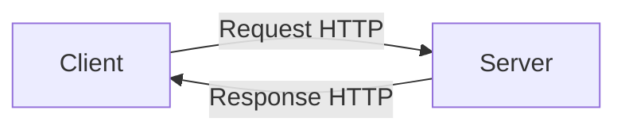

#### Modelo Publish/Subscribe

* Os vários dispositivos "publicam" as informações para um mesmo MQIT Brocker
* O MQIT Brocker disponibiliza as informações recebidas para outros softwares inscritos

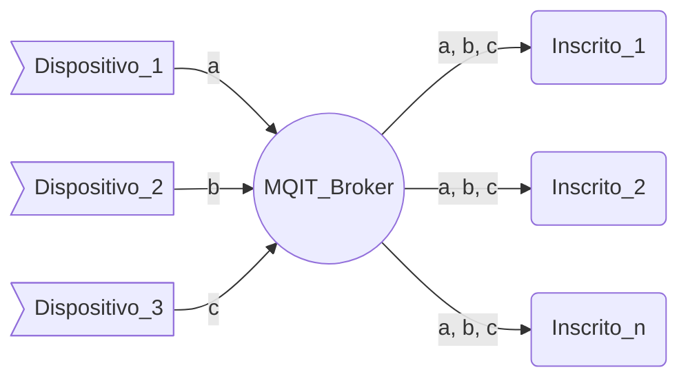

---

## Flexibilidade dos tópicos e Cloud:

### Template:

`protocol://broker/user_indentifier/sensor/information`

### Exemplo:

`mqtt://broker.io/a6g3i9/gsp/position.json`

### QoS 0

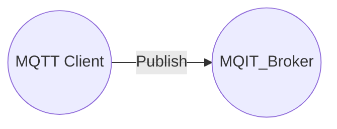

* Nível mínimo e menor esforço
* Sem garantia de entrega
* Não retransmissível

### QoS 1

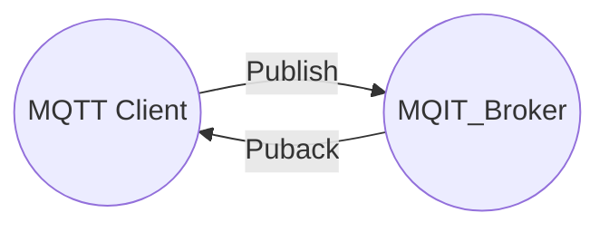

* Garante que ao menor uma vez a mensagem foi entrege ao recebedor
* Mensagem pode ser retransmitida caso não haja confirmação de entregas

```python
mensagem = MC.publish("Esse post no twitter pode ser fake!")
mensagem_falhou = False
while mensagem_falhou:
    confirmação_recebida = MC.hear(MB)
    if confirmação_recebida:
        break
    else:
    	MC.republish(mensagem)
```

### QoS 2

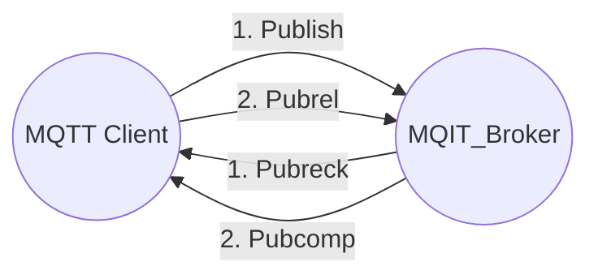

* Garante que a mensagem foi entregue no mínimo uma vez ao recebedor
* Mensagem pode ser retransmitida se não houver confirmação de entrega

### Cloud

* Grande e cada vez maior de devices conectados;

* É dependência do IOT;

* Potencial de escala global.

  #### Exemplo de Cloud para um app de transporte:

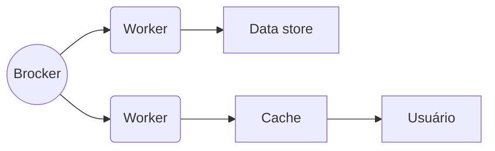

* **Data Store:** Armazena cada posição geográfica recebida do usuário.
* **Usuário:** Apresenta em tempo real a posição última apenas.

#### Armazenamento dos dados:

##### Relacional DB:

| User | Timestamp | Lat         | Lon        |
| ---- | --------- | ----------- | ---------- |
| a    | 12345678  | -33.333.333 | -33.333.33 |
|b|87654321|44.444.444|-44.444.444|

##### Document DB:

```json
[
    {
        "user" : "a",
        "timestamp" : 12345678,
        "lat" : "-33.333.333",
        "lon" : "-33.333.333"
    },
    {
        "user" : "b",
        "timestamp" : 87654321,
        "lat" : "-44.444.444",
        "lon" : "-44.444.444"
    },
]
```

## Estudo de caso:

### Arquitetura é escolha:

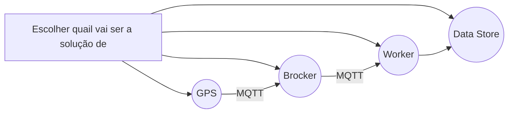

### Prove de conceito:

---

#### Solução 1:

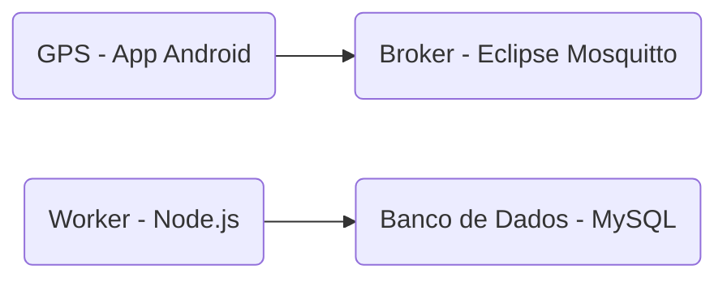

---

#### Solução 2:

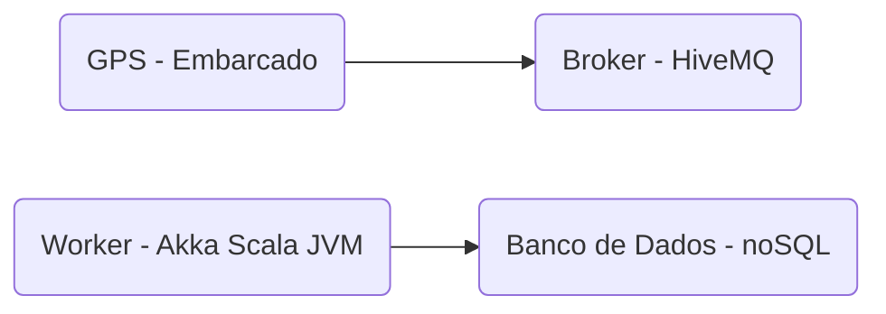

---

#### Solução 3:

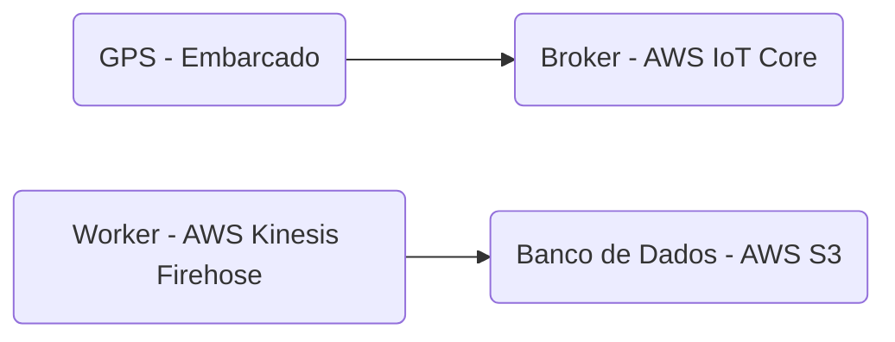

---

### IoT na prática:

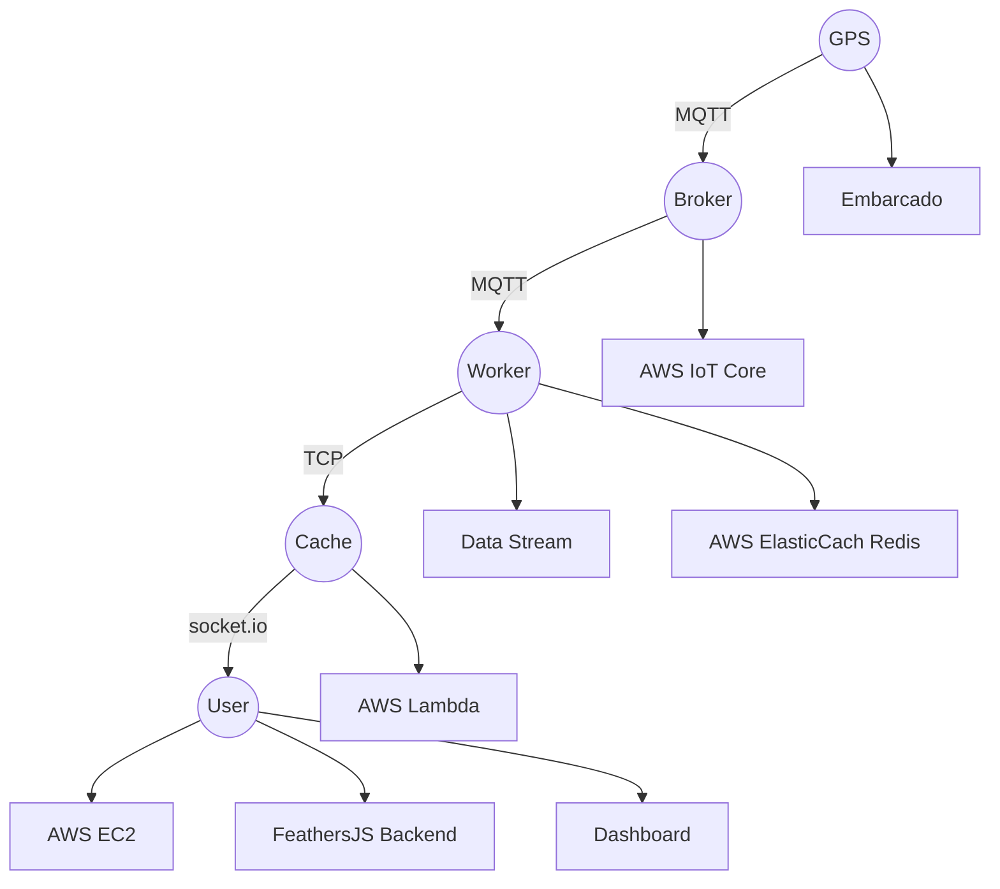

## <ins>Módulo:</ins> Arquitetura de dados essencial

## Conceitos introdutórios e o que é um banco de dados:

### Dados:

* Conjunto de valores que descrevem uma ocorrência, características etc

#### Importância:

* Gerar informação, a partir de análises

---

### Dados Digitais:

`Lorem Isum (00)9 9999-1111 120, 19`

`Velit Esse Celit 991173498 1,150,11`

* Não está claro a divisão de informação, deduzimos que é um nome, telefone, valor de dinheiro etc. Mas não temos certeza;

### Modelo sustentável de dados:

* **Estrutura** - Padões;
* **Durabilidade** - Não se perder, ou durar enquanto for necessário;
* **Velocidade do Acesso** - No caso de um grande volume de dados;
* **Controle de Acesso** - Segurança da Informação;
* **Isolamento.**

### Abstração:

#### SGDBs - Sistemas Gerenciadores de Banco de Dados

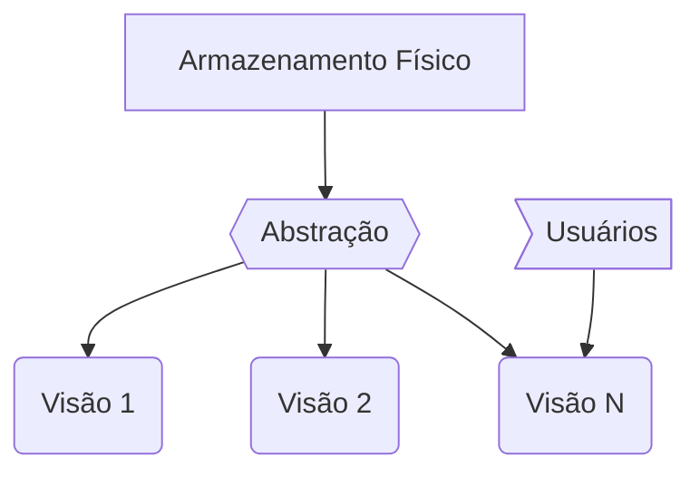

##### Pilares:

* **Linguagem de Definição**
* **Linguagem de Manipulação**
* **Dicionário de Dados**

### Modelos:

#### Modelo Flat:

|            | Nome   | Telefone      | Profissão |
| ---------- | ------ | ------------- | --------- |
| Registro 1 | Aninha | (11) 99999999 | Arquiteta |


#### Modelo Hierárquico:

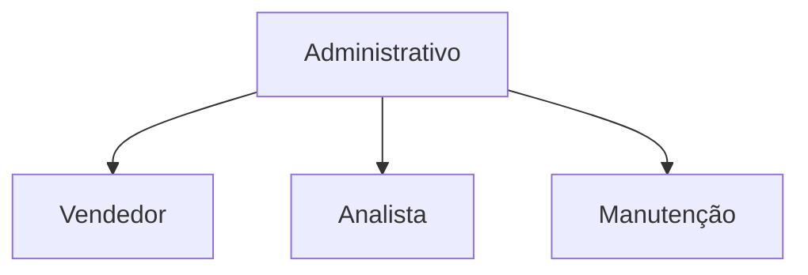

#### Modelo Relacional:

| Código Pessoa | Nome  | Telefone        | Profissão |
| ------------- | ----- | --------------- | --------- |
| 111           | Lorem | (99) 99999-1222 | 4         |

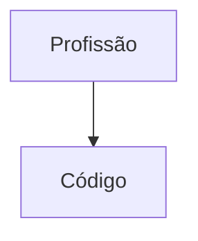


| Código | Profissão     |
| ------ | ------------- |
| 1      | Vendedor      |
| 2      | Consultor     |
| 3      | Arquiteto     |
| 4      | Desenvolvedor |

#### Outros Modelos:

1. Redes - Grapho;
2. Orientado a Objetos
3. Objeto-Relacional
4. Big Data

---

## Banco de dados relacionais:

> Modelo mais utilizado nas indústrias

### SGDBR - RDBMS - Sistema de Gerenciamento de Banco de Dados Relacionais:

* **Entidades:**

  * Tabelas;
  * Registros/Tuplas: Linhas;
  * Dicionário: Colunas;

  * Chave PK/FK;

### Modelagem:

1. Modelo conceitual - MER (Modelo de Entidade e Relacionamento).

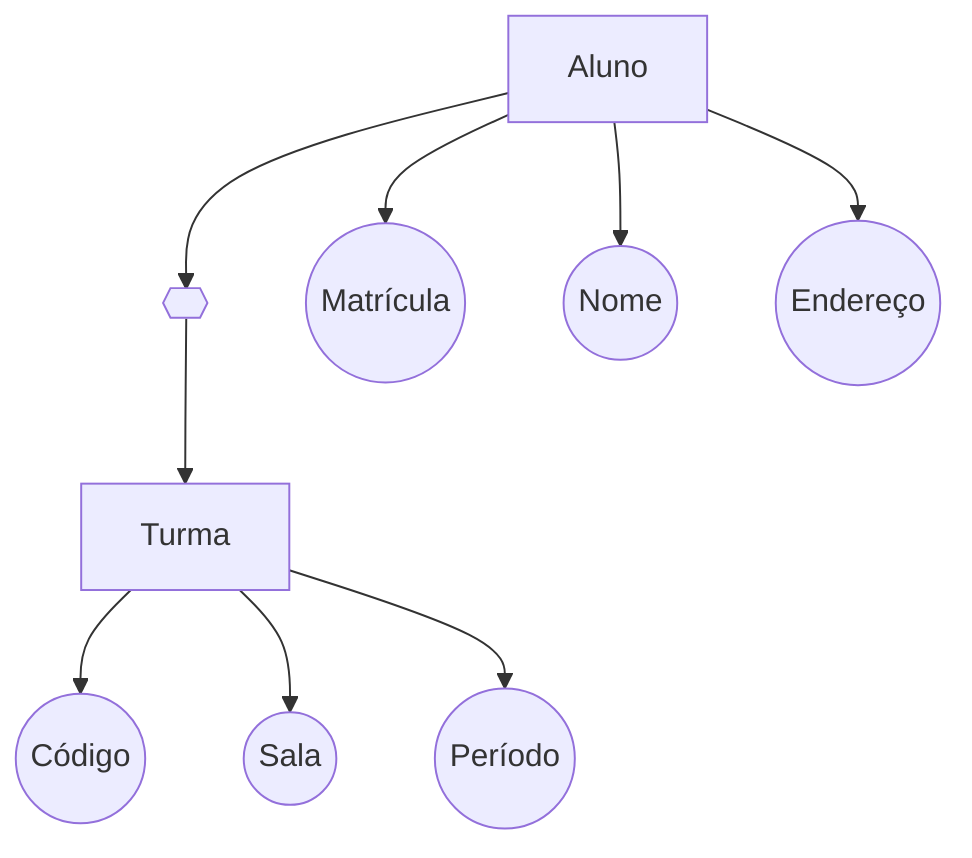

2. Modelo Lógico - Implementação

#### MER - DER (Diagrame de Entidade e Relacionamento)


---

### Normalização:

* 1 - 5º formas normais;
* 1 - 3º são as formas mais comuns;

| Código | Nome  | Tel.                                | Profissão    |
| ------ | ----- | ----------------------------------- | ------------ |
| 1      | Lorem | ***(11) 999999999 (33 333333333)*** | Vendedor     |
| 2      | Ipsum | (55) 444444444                      | ***Vendor*** |

**Erros:** Dois valores na mesma coluna e linha; falsa diferença por erro de digitação.

## SGDBR - SQL

* **SGDBR:** Sistema Gerenciador de Banco de Dados Relacionais - SQL

* **SQL:** Structured Query Language

### Pilares:

* **DDL** - Data Definitions Language - Linguagem para alterar fisicamente o banco de dados.

* **DML** - Data Manipulation Language - Para acessar e transformar os dados.

* **DQL** - Data Query Language - Sintaxe para acessar os dados.

---

### DDL:

```sql
Create Table Cliente
(
Codigo number(10) Not Null Primary Key,
Nome varchar(50) Not Null,
Telefone varchar(15)
)
```

---

### DML:

````sql
Insert into Cliente(Codigo,Nome,Telefone)
values(1,"Luis Felipe", "(11) 958872079")

Delete from Cliente
where Codigo = 1

Update Cliente
set Nome = "Luiz Felipe Nascimento"
where Codigo = 1
````

---

### DQL:

```sql
Select Codigo,
		Nome
from CLiente

<Where>Codigo = 1
	<Group by> Profissao
	<Having> Count(1) > 0
<Order by> Nome, Codigo
```

---

### Álgebra Relacional:

```sql
Select Codigo,
		Nome
	from Cliente
	Where Codigo = 2
		Union
Select Codigo,
		Nome
	from Cliente
	Where Nome = "Luiz Felipe Nascimento"
```

#### Tabela 1 - Item_venda:

| Venda | Code_Prod | Qtd  | Val  |
| ------  | ----------- | ----- | ---- |
| 1         | 1       | 10               | 22,30 |
| 2     | 1         | 11   | 22,30 |
| 3     | 2         | 10   | 30,00 |

#### Tabela 2 - Produto:

| Code | Descricao | Val   |
| ---- | --------- | ----- |
| 1    | Lápis     | 19,00 |
| 2    | Caneta    | 35,00 |
| 3    | Borracha  | 5,00  |

#### Juntando as duas:

```sql
Select Quantidade
		, Val
		,Descricao
	from Item_venda
JOIN Produto
ON Code = Code_Prod
	Where Val > 5
```

---

### Funções de Conjunto:

```sql
Select Sum(ven.Qtd) as QTotal
       , Sum(ven.Val) as VTotal
       , pro.Descricao
	from Item_venda ven
	JOIN Produto pro
	ON pro.Codigo = ven.Code_Prod
Where ven.Valor > 5
Group by pro.Descricao
Having SUm(ven.Valor) = 10
```

### Index:

| Code | Nome  | Profissao | Genero |
| ---- | ----- | --------- | ------ |
| 111  | Lorem | 1         | F      |
| 222  | Ipsum | 1         | M      |
| 333  | Velit | 2         | M      |
| 444  | Vossi | 3         | F      |

```sql
Select ...
Where Profissao = 1
and Genero =  "M"
```

* Nesse caso, retornaria todos os dados da tabela cujos o gênero seja "M" e a profissão seja 1;

* No caso, apenas (222, Ipsum, 1, M);

* Porém, caso o banco seja grande, teria um erro de performance.

* O **Index** é uma sub-tabela derivada da tabela original, contendo apenas os valores que você quer procurar;

* Algo como:

  | Profissao | Genero |
  | --------- | ------ |
  | 1         | F      |
  | 1         | M      |
  | 2         | M      |
  | 3         | F      |

## Transactions:

* Controlar acessos e operações ao BD simultaneamente.
* Impedir sobreposições.

### ACID:

* **Atomicidade:** todas as alterações serem realizadas com sucesso.
* **Consistência:** o sistema precisa garantir a unicidade das chaves e restrições lógicas.
* **Isolamento:** as várias transações podem acontecer simultâneamente.
* **Durabilidade:** Depois de aplicado o commit, as alterações precisam ser aplicadas, isso pode ser resolvido por meio de logs.

## SGDBR na pratica:

### Comerciais:

* Oracle;
* Microsoft SQL;
* IBM DB2.

### Gratuitos:

* PostgreSQL;
* MySQL;
* SQLite.

### Instalando o PostgreSQL:

https://www.postgresql.org/download/windows/

## Criando o banco de dados:


## <ins>Módulo:</ins> Conceitos de responsividade e experiência do usuário

## Tópicos introdutórios sobre UX e UI:

### Briefing, Imersão e Unpack:

* **Briefing:** entender o objetivo de um projeto para gerar uma solução mais assertiva e adaptada;
* **Imersão:** conhecer o contexto do problema, o público, as regras do negócio etc. É a base de conhecimento necessário para delimitar uma solução;
* **Unpack:** Ouvir várias perspectivas de profissionais distintos e complementares.

### Wireframes, Grids e Hierarquia:

#### Wireframes:

* **Estrutura:** Como os objetos devem ser posicionados;
* **Conteúdo:** Como serão colocados os conteúdos para ajudar a interatividade do usuário.
* **Hierarquia informativa:** Como o conteúdo vai ser organizado e apresentado?
* **Funcionalidade:** Usabilidade na interface, como o usuário se comporta?

#### Grids, Alinhamento e Espaçamento:

* Fluxo de leitura do usuário. Manter uma qualidade visual.

#### Luzes, Sombras, Consistência e Padrão:

* As luzes e sobras garantem movimento, profundidade, contrastes e sobreposições. Demarcar áreas de interatividade.
* Consistência e padrão.
  * **UX Writer:** linguagem para o público alvo;
  * **Design System:** sistemas de padrões e consistências visuais;
  * **UX Design:** garante a mesma consistência em vários monitores, responsividades.

## Cores da Interface:

* Psicologia das cores, para melhorar a experiência do usuário.

### Cores UI Primárias:

* **Paleta Primária:** Azul, Laranja Cinza

### Cores UI Secundárias:

* **Paleta secundária:** Cores conhecidas pelo usuário.

* Verde, vermelho, amarelo; Sucesso, erro, etc.

### Cores Gradiente:

* Impacto visual, dinamismo, movimento, intuitividade etc.

---

### Tipografia:

* **Qual escolher?** - Pesar como uma roupa, o que as fontes podem dizer sobre a proposta da interface?

#### Tipos de Fonte:

* **Serifadas:** pequenos traços no final das letras, trazem seriedade e tradicionalidade.
* **Sem-serifa:** traz modernidade e intimidade;
* **Cursivas:** diversos tipos, descontraídas, divertidas, luxo etc;
* **Decorativa ou Fantasia:** usadas para chamar a atenção, deve ser usada com moderação e propósito.

#### Tamanho e peso:

* **Tamanho** confortável, tendo em vista a distância da tela que o usuário está da tela.
* **Peso** é a "grossura". Thin, Light, Normal, Medium, Bold, Black etc.

## Componentes da Interface do Usuário:

### Iconografia:

* Comunicar visualmente uma mensagem.

#### Como utilizar os ícones:

* O mais simples possível;
* Claro e objetivo;
* Combinar os ícones com palavras;
* Escolher cores familiares;
* Usar espaçamento e tamanho apropriado.
* Consistência e clareza nos padrões.

---

### Utilizar imagens:

* Fazer com que o usuário entenda a mensagem.
* Ter um contexto relevante, o conteúdo ter uma forte relação.

---

### Guia de Estilo:

* Preservar a identidade visual da marca e padrões nas plataformas.

## Como aplicar os conceitos em projetos:

### Responsividade:

* Gerenciar a aplicação diferentes tamanhos de tela;
*  Usabilidade adaptada.

### Acessibilidade:

* Inclusão em diversos espectros dos usuários;
* Fazer pesquisas com o ambiente de uso e dificuldades do usuário;
* Construir serviços que funcionem para todos;

### Prototipagem:

* Utilidade - melhorar, visualizar e atualizar modelos, refeita ao longo do processo.
* Fidelidade - Baixa, média e alta fidelidade. Visualização simples, acessos, mockup.

### Portfolio, Clientes e Apresentação:

* Mostrar o trabalho à possíveis contratantes;
* Mostrar profissionalismo;
* Desafio, solução e projeto finalizado;
* Trabalhos fictícios.
* Fazer por conta própria uma melhoria de um projeto existênte.

## Bibliografia complementar e dicas do especialista:

### Dicas:

* **Medium:** ui-lab-school / ux-strateg
* ideo.com
* material.io
* **YouTube:** UX Lab / UX Now
* **Livros:**
  * Não me faça pensar
  * Arquitetura de informação para World Wide Web

### Proposta final:


---

# Certificado \o/

### https://certificates.digitalinnovation.one/DC66507A